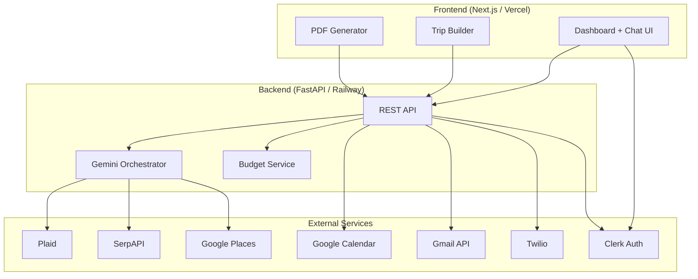

# OIKOS — Household Financial AI

**The financial nervous system of your household.**

OIKOS is a conversational AI that understands a family's real financial reality through Plaid and orchestrates real-world decisions — trips, dining, budgets, and family coordination — through live APIs.

**Live demo:** [oikos-household-financial-app.vercel.app](https://oikos-household-financial-app.vercel.app)

**Repository:** [github.com/sathwik0312/OIKOS---Household-Financial-App](https://github.com/sathwik0312/OIKOS---Household-Financial-App)

---

## Table of Contents

- [Overview](#overview)
- [The Problem](#the-problem)
- [The Solution](#the-solution)
- [Key Features](#key-features)
- [Architecture](#architecture)
- [Tech Stack](#tech-stack)
- [Project Structure](#project-structure)
- [Getting Started](#getting-started)
- [Environment Variables](#environment-variables)
- [Deployment](#deployment)
- [Demo Script](#demo-script)
- [What's Real vs Simulated](#whats-real-vs-simulated)
- [Contributors](#contributors)

---

## Overview

Most households manage money across 12+ disconnected apps — banking, calendar, travel, restaurants, messaging — with no single place to ask *"Can we actually afford this?"*

OIKOS solves that with a **household-aware AI agent** that:

1. Reads real spending and budget data via **Plaid**
2. Reasons against live constraints using **Google Gemini**
3. Orchestrates external tools — flights, hotels, restaurants, calendar, email, SMS
4. Negotiates trade-offs when budget is tight instead of just saying no

OIKOS is **not** a travel agent or a static budgeting dashboard. It is an always-aware intelligence layer that makes decisions *with* the family, grounded in real financial data.

---

## The Problem

American families overspend because every spending decision is made blind:

- Bank apps show balances, not intent
- Travel apps show prices, not household budget context
- Calendars don't know what a trip costs
- No one connects "Can we go to Austin?" to "We have $420 left in travel this month"

---

## The Solution

A single conversational interface where every answer is grounded in the household's financial snapshot.

| User asks | OIKOS does |
|---|---|
| *"Can we do a weekend trip to Austin?"* | Checks travel budget → searches live flights/hotels → returns total cost + gap analysis |
| *"What's left for groceries?"* | Pulls real Plaid transactions → returns remaining budget + recommendation |
| *"Plan a 3-day NYC trip under $2,000"* | Launches interactive Trip Builder → day-by-day itinerary → PDF → calendar + family notification |
| *"We overspent this month"* | Surfaces category breakdown → suggests recovery plan for remaining days |

---

## Key Features

### 1. Household Financial Dashboard
- Multi-member household auth via **Clerk**
- Real bank + card data through **Plaid** (sandbox for demo)
- Auto-categorized spending: Travel, Dining, Groceries, Leisure, Utilities
- Budget pulse with spent / remaining / committed views
- Per-member spending breakdown
- Demo scenarios (A/B/C) for hackathon presentations without live Plaid data

### 2. OIKOS Chat Agent (Gemini Orchestrator)
- **Gemini 3.1 Flash Lite** with full household financial context injected on every turn
- Persistent chat history per session
- Tool dispatch for flights, hotels, restaurants, budget reallocation, trip builder, and confirmation
- Budget-constrained reasoning — proposes alternatives when over budget
- Proactive warnings when categories cross 90% usage

### 3. Trip Planner
- Live flight search via **SerpAPI** (Google Flights engine)
- Live hotel search via **SerpAPI** (Google Hotels engine)
- Restaurant and activity discovery via **Google Places API**
- Full trip cost estimate before any commitment
- Budget recovery suggestions when trip exceeds available funds

### 4. Interactive Trip Builder
- Multi-step in-chat flow: Flights → Hotel → Places → Restaurants → Summary
- AI negotiation bubbles between steps with budget-aware feedback
- Day-by-day itinerary assembly
- PDF itinerary preview and download
- One-click trip confirmation

### 5. Family Sync & Confirmation
- **Google Calendar** OAuth — trip events added for the household
- **Gmail API** — branded confirmation email with PDF attachment
- **Twilio** — SMS/WhatsApp notifications to all household members
- Upcoming trips widget on the dashboard
- Budget alert notifications at 90% category usage

---

## Architecture



**Request flow (trip confirmation):**

1. User confirms trip in Trip Builder summary
2. Backend saves `PlannedTrip` to SQLite
3. Google Calendar event created for household
4. PDF generated client-side → base64 sent to backend → Gmail API sends email
5. Twilio sends SMS/WhatsApp to all members with trip summary + remaining budget

---

## Tech Stack

| Layer | Technology |
|---|---|
| Frontend | Next.js 16, React 19, TypeScript, Tailwind CSS v4 |
| Backend | FastAPI, Python 3.10+, SQLAlchemy, SQLite |
| AI | Google Gemini 3.1 Flash Lite (`google-genai`) |
| Auth | Clerk (multi-user household) |
| Finance | Plaid API (sandbox) |
| Flights & Hotels | SerpAPI (Google Flights / Google Hotels) |
| Restaurants & Activities | Google Places API |
| Calendar & Email | Google Calendar API + Gmail API (shared OAuth) |
| Notifications | Twilio SMS / WhatsApp |
| PDF | `@react-pdf/renderer` (client-side generation) |
| Frontend hosting | Vercel |
| Backend hosting | Railway |

---

## Project Structure

```
OIKOS/
├── frontend/
│   ├── app/
│   │   ├── (auth)/              # Clerk sign-in / sign-up
│   │   └── (dashboard)/         # Dashboard, chat, settings, trip planner
│   ├── components/
│   │   ├── chat/                # Chat UI, message bubbles, plan confirmation
│   │   ├── dashboard/           # Budget pulse, Plaid connect, upcoming trips
│   │   ├── trip-builder/        # Multi-step interactive trip builder
│   │   └── pdf/                 # Trip itinerary PDF template
│   └── lib/                     # API client, shared types
│
├── backend/
│   ├── routers/                 # FastAPI route handlers
│   │   ├── auth.py              # Clerk JWT verification
│   │   ├── household.py         # Household CRUD + invite links
│   │   ├── plaid.py             # Plaid Link + budget status
│   │   ├── chat.py              # Gemini chat endpoint
│   │   ├── trip.py              # Upcoming trips
│   │   ├── trip_builder.py      # Flights, hotels, confirm flow
│   │   ├── calendar.py          # Google Calendar OAuth
│   │   └── notify.py            # Notification settings
│   ├── services/
│   │   ├── gemini_service.py    # AI orchestration + tool dispatch
│   │   ├── budget_service.py    # Transaction + budget calculations
│   │   ├── travel_service.py    # SerpAPI flights + hotels
│   │   ├── yelp_service.py      # Google Places (restaurants + activities)
│   │   ├── places_service.py    # Google Places (attractions)
│   │   ├── calendar_service.py  # Google Calendar OAuth + events
│   │   ├── email_service.py     # Gmail API + PDF attachment
│   │   └── twilio_service.py    # SMS/WhatsApp notifications
│   ├── models/                  # SQLAlchemy models
│   ├── mock_data/               # Demo transaction scenarios A/B/C
│   ├── main.py                  # FastAPI app entry point
│   ├── Procfile                 # Railway process definition
│   └── requirements.txt
│
└── README.md
```

---

## Getting Started

### Prerequisites

- **Node.js** 18+
- **Python** 3.10+
- API keys for: Clerk, Plaid (sandbox), Gemini, SerpAPI, Google Cloud (Places + Calendar + Gmail), Twilio

### 1. Clone the repository

```bash
git clone https://github.com/sathwik0312/OIKOS---Household-Financial-App.git
cd OIKOS---Household-Financial-App
```

### 2. Backend setup

```bash
cd backend
python3 -m venv venv
source venv/bin/activate        # Windows: venv\Scripts\activate
pip install -r requirements.txt
```

Create `backend/.env` (see [Environment Variables](#environment-variables) below), then start the server:

```bash
uvicorn main:app --reload --port 8000
```

Verify: [http://localhost:8000/health](http://localhost:8000/health) → `{"status": "ok"}`

### 3. Frontend setup

```bash
cd frontend
npm install
```

Create `frontend/.env.local` (see below), then start the dev server:

```bash
npm run dev
```

Open [http://localhost:3000](http://localhost:3000).

### 4. Plaid sandbox credentials

When Plaid Link opens during onboarding:

| Field | Value |
|---|---|
| Username | `user_good` |
| Password | `pass_good` |

---

## Environment Variables

### Backend (`backend/.env`)

```bash
# Auth
CLERK_SECRET_KEY=sk_test_...
CLERK_WEBHOOK_SECRET=whsec_...

# Database
DATABASE_URL=sqlite:///./oikos.db

# Plaid
PLAID_CLIENT_ID=...
PLAID_SECRET=...
PLAID_ENV=sandbox

# AI
GEMINI_API_KEY=...

# Travel search
SERPAPI_KEY=...
USER_HOME_CITY=New York
USER_HOME_IATA=JFK

# Google (Places + Calendar + Gmail — same Cloud project)
GOOGLE_PLACES_API_KEY=...
GOOGLE_CLIENT_ID=...
GOOGLE_CLIENT_SECRET=...
GOOGLE_REDIRECT_URI=http://localhost:8000/api/calendar/callback

# Notifications
TWILIO_ACCOUNT_SID=...
TWILIO_AUTH_TOKEN=...
TWILIO_FROM_NUMBER=+1...
TWILIO_WHATSAPP_FROM=whatsapp:+1...

# CORS
FRONTEND_URL=http://localhost:3000
```

### Frontend (`frontend/.env.local`)

```bash
NEXT_PUBLIC_CLERK_PUBLISHABLE_KEY=pk_test_...
CLERK_SECRET_KEY=sk_test_...
NEXT_PUBLIC_CLERK_SIGN_IN_URL=/sign-in
NEXT_PUBLIC_CLERK_SIGN_UP_URL=/sign-up
NEXT_PUBLIC_CLERK_AFTER_SIGN_IN_URL=/dashboard
NEXT_PUBLIC_CLERK_AFTER_SIGN_UP_URL=/dashboard
NEXT_PUBLIC_API_URL=http://localhost:8000
```

> **Never commit `.env` or `.env.local` files.** They are listed in `.gitignore`.

---

## Deployment

### Frontend — Vercel

1. Connect the GitHub repository to Vercel
2. Set root directory to `frontend`
3. Add all `NEXT_PUBLIC_*` and `CLERK_SECRET_KEY` environment variables
4. Set `NEXT_PUBLIC_API_URL` to your Railway backend URL

### Backend — Railway

1. Connect the GitHub repository to Railway
2. Set root directory to `backend`
3. Railway reads `backend/Procfile` automatically:

   ```
   web: uvicorn main:app --host 0.0.0.0 --port $PORT
   ```

4. Add all backend environment variables from the table above
5. Set `FRONTEND_URL` to your Vercel deployment URL
6. Update `GOOGLE_REDIRECT_URI` to `https://<your-railway-url>/api/calendar/callback`

---

## Demo Script

**Scene 1 — Household Pulse (30 sec)**  
Sign in → Dashboard shows budget categories, per-member spending, and upcoming committed expenses.

**Scene 2 — The Trip Question (60 sec)**  
Ask: *"Can the family do a weekend trip to Austin next weekend?"*  
Gemini checks travel budget → searches live flights and hotels → returns total estimate and budget gap with alternatives.

**Scene 3 — Interactive Trip Builder (90 sec)**  
Confirm destination → step through Flights → Hotel → Places → Restaurants → Summary → Preview PDF → Confirm Trip.

**Scene 4 — Family Sync (30 sec)**  
Trip confirmed → Google Calendar event created → Gmail with PDF sent → WhatsApp/SMS to family → trip appears on dashboard.

---

## What's Real vs Simulated

| Feature | Status | Notes |
|---|---|---|
| Bank balances + transactions | Real | Plaid Sandbox; upgradeable to production |
| Budget calculations | Real | Computed from Plaid or demo scenario data |
| Flight prices | Real | SerpAPI Google Flights engine |
| Hotel prices | Real | SerpAPI Google Hotels engine |
| Restaurants & attractions | Real | Google Places API |
| Google Calendar events | Real | Created live via OAuth |
| Email confirmations | Real | Gmail API with PDF attachment |
| SMS / WhatsApp | Real | Twilio |
| Final flight/hotel booking | Deeplink | Handoff to airline/OTA — no IATA certification required |

---

## Build Status

| Module | Description | Status |
|---|---|---|
| PRD-01 | Foundation — Auth, Plaid, Dashboard | Done |
| PRD-02 | Gemini Orchestrator & Chat | Done |
| PRD-03 | Trip Planner (SerpAPI + Google Places) | Done |
| PRD-04 | Budget Recovery Mode | Done |
| PRD-05 | Family Sync (Calendar + Twilio) | Done |
| PRD-06 | Interactive Trip Builder | Done |
| PRD-07 | PDF Itinerary, Email & SMS Confirmation | Done |

---

## Contributors

Built for the **Personal Executive Agent (Consumer)** hackathon track.

| Name | Role |
|---|---|
| Krishna Sai | Backend, AI orchestration, integrations |
| Sathwik | Frontend, UI/UX, deployment |

---

## License

This project was built for a hackathon demo. All rights reserved by the contributors.
